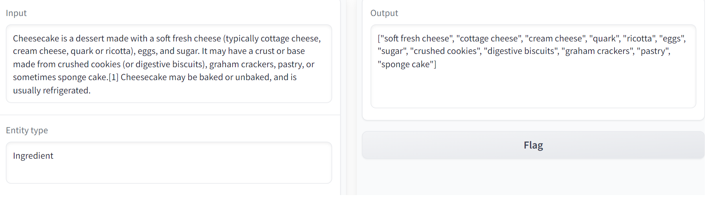
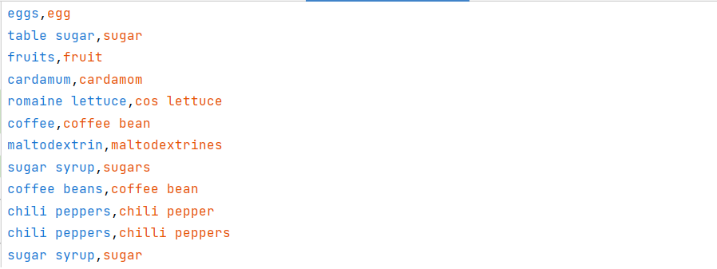
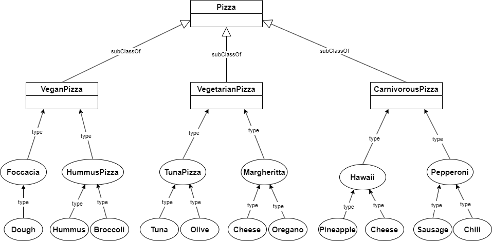
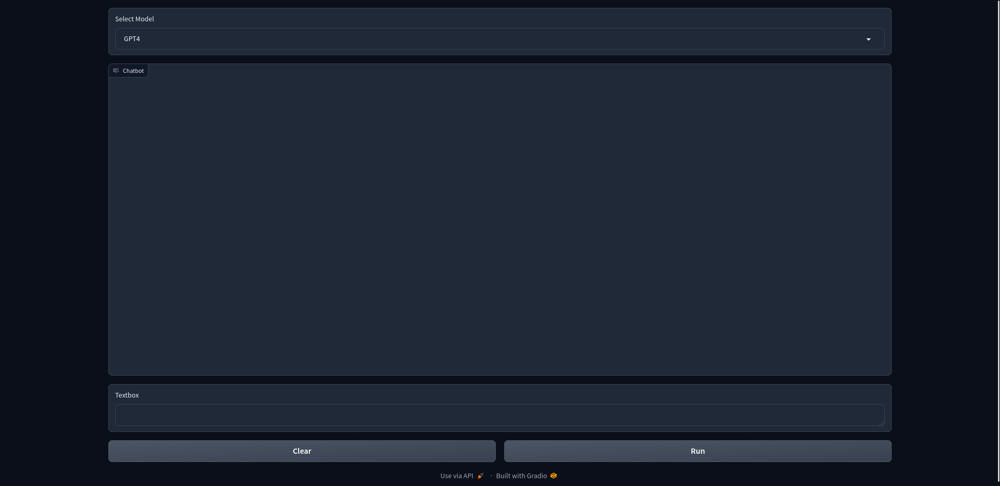

# Food-RAG
Food-RAG je projekat koji omogućava korisnicima da jednostavno istražuju sastojke različitih jela kroz postavljanje upita u prirodnom jeziku. U projektu je implementirana ontologija u formi RDF grafa koja čuva podatke o sastojcima i jelima. Korisnicima se prikazuje jednostavan interfejs i pruža im se mogućnost da postavljaju upite u četu, koji se kasnije prevode u SPARQL oblik i izvršavaju se nad kreiranom ontologijom. 

## Instalacija
Za instalaciju neophodno je koristiti Python verziju 3.10 ili noviju.
Neophodni Python paketi nalaze se u requirements.txt fajlu, i mogu se instalirati sa
```shell
pip3 install -r requirements.txt
```

Takođe je neophodno imati ili imati .env fajl dodat u putanji projekta, ili postavljene sistemske varijable za OpenAI API ključeve.
.env fajl prati sledeći format
```
OPENAI_API_KEY= <VAŠ API KLJUČ>
OPENAI_ORGANIZATION= <VAŠA ORGANIZACIJA, UKOLIKO JE IMATE>
```
## Pokretanje
Pokretanje aplikacija vrši se na sledeći način:
```shell
python3 main.py
```

Pomenuti fajl *main.py* koristi ontologiju skladištenu u fajlu *pizza.rdf* u folderu *files*. Ta ontologija je kreirana pokretanjem nekoliko fajlova. Najpre su pokrenuti fajlovi iz foldera *ontology*:

1. *add_dishes.py*
2. *get_ingredients_colab.py*
3. *add_ingredients.py*
   
Zatim su pokretani fajlovi iz foldera *synonyms*:

5. *bert.py*
6. *add_to_file.py*

I na kraju fajlovi foldera *pizza*:

7. *add_to_file.py*


## Ontologija
Inicijalnu verziju ontologije kreirali smo upotrebom **_Protégé_** alata. Ona je sadržala samo klase *Dish* i *Ingredient*. *ObjectProperty* relacija *hasIngredient* je definisana tako da je tranzitivna i da su joj domen klase *Dish* i *Ingredient*, a *range* Ingredient. Ova jednostavna ontologija nalazi se u fajlu *empty_ontology_protege.rdf*. 

Prvi korak u popunjavanju ontologije bio je ubacivanje jela. Najpre smo pokušali da ubacimo stotinu poznatih svetskih jela, ali smo zbog eksponencijalnog rasta broja sastojaka, prilikom ekstrahovanja istih, dobili grešku zbog dostignute maksimalne dubine rekurzije. Zbog toga smo odlučili da našu ontologiju inicijalno populišemo sa 20 jela. O samom procesu rekurzivnog ekstrahovanja sastojaka biće reči u nastavku.


Sledeći korak bio je popunjavanje ontologije sastojcima već umetnutih jela. Za tu svrhu smo koristili Python biblioteku **_wikipedia_**. Ona nudi jednostavnu funkciju *summary(article, sentences)* za sumarizaciju. Prvi parametar je naziv članka na vikipediji. Drugi je broj rečenica koji želimo da koristimo za sumarizaciju. U našem slučaju, odabrali smo vrednost 3, jer se u člancima o hrani na vikipediji sastojci obično pojavljuju u 3 najbitnije rečenice. Kada smo doblili kratku reprezentaciju članka, bilo je potrebno ekstrahovati podatke iz te reprezentacije. To smo postigli upotrebom **UNI-NER** (*Universal Named Entity Recognition*) modela. To je manji jezički model (7 milijardi parametara) namenjen za prepoznavanje imenovanih entiteta. Funkcioniše tako što mu se prosledi tekst i naziv entiteta koji se ekstrahuje. U našem slučaju, prosleđeni tekst bio je sumarizovani članak, a naziv entiteta koji se pronalazi bio je *“Ingredient”*. Na slici 1 vidmo primer kako UNI-NER funkcioniše:


Slika 1 - primer upotrebe UNI-NER-a

UniNER možete probati i na [linku](https://universal-ner.github.io/linku)

Nismo imali dovoljno memorije da pokrenemo ovaj model lokalno, te smo ga, umesto toga,  pokrenuli na **_Google Colab_**-u. Nakon što smo ekstrahovali podatke o svakom jelu iz liste, **rekurzivno** smo pozivali funkcije ekstrakcije nad dobijenim sastojcima i taj proces ponavljali dok god postoje podaci o sastojcima. Na taj način smo za svako jelo dobili graf sastojaka. Ubacivanjem tih podataka u postojeću ontologiju dobili smo fajl *ingredients.rdf*.

Nakon što smo ubacili podatke u ontologiju, uvideli smo da naša ontologija ne prepoznaje sinonime. Na primer, sastojci *“sugar”*, *“sugars”* i *“table sugar”* su prepoznavani kao različiti iako predstavljaju isti sastojak. Taj problem smo najpre pokušali da rešimo korištenjem samo **_“word2vec”_** modela, ali on nije dao dovoljno dobre rezultate. Nakon toga smo pokrenuli **_BERT_** *sentence-transformer* za računanje sličnosti:  *“paraphrase-multilingual-MiniLM-L12-v2”*. Prepoznate sinonime sačuvali smo u fajlu *bert_synonyms.csv*. Neki od dobijenih sinonima prikazani su na slici 2:



Slika 2 - primeri sinonima dobijenih upotrebom BERT modela

Ipak, ni ovi sinonimi nisu bili savršeno prepoznati, pa smo ih ručno filtrirali i upisali u fajl *filtered_synonyms.csv*. Končano, ove sinonime smo ubacili u ontologiju u fajl *with_synonyms.rdf*. Uveli smo novu tranzitivnu relaciju *hasSynonym*.

S obzirom na to da su podaci o jelima većinski bili automatski generisani i ponekad nepotpuni, odlučili smo da u ontologiju detaljno razradimo jednu vrstu hrane. Opredelili smo se za picu. Krierali smo taksonomiju pica i deo nje je prikazan na slici 3:



Slika 3 - deo taksonomije o picama


## Upiti
Imavši u vidu da ciljna demografska grupa aplikacije ne postoji, već da je namenjena svima, neophodno je da njihovo korišćenje bude što jednostavnije. Klasičan način za interagovanje sa ontologijama jeste pomoću SPARQL upita, koji zahtevaju poznavanje rigidne sintakse i detalje same ontologije. Zbog toga, dodat je sloj apstrakcije u vidu velikog jezičkog modela koji bi na osnovu slobodnog teksta generisao SPARQL upite. Potom, ti upiti izvršavali bi se nad RDF grafom, i rezultati upita bili bi interpretirani od strane velikog jezičkog modela, kako bi se pretvorili u tekst koji je pogodan korisniku.
Primer jednog od upita bio bi:
```sparql
PREFIX ns1: <http://www.semanticweb.org/nevena/ontologies/2023/11/food_ontology.owl#>

SELECT ?ingredient
WHERE {
   ns1:biryani ns1:hasIngredient ?ingredient .
}
```
Veliki jezički modeli koji su korišćeni GPT 4, GPT 3.5, kao i Code LLaMa. Za pokretanje Code LLaMa modela, neophodno je imati pokrenut [Ollama](https://ollama.ai/) server i preuzet "codellama:7b-instruct" model.
U cilju pojednostavljenja toka podataka, korišćena je LangChain biblioteka za komunikaciju sa jezičkim modelima. Code LLaMa generalno generiše ispravne upite, međutim dešava se da često dodaje komentare na sam početak upita.
Na primer, jedna od standardnih greški izgledala bi ovako:

```sparql
``Here is the query to get all the ingredients for biryani
PREFIX ns1: <http://www.semanticweb.org/nevena/ontologies/2023/11/food_ontology.owl#>

SELECT ?ingredient
WHERE {
   ns1:biryani ns1:hasIngredient ?ingredient .
}
``
```

Greške tog tipa su relativno česte i prate sličan format - dodato objašnjenje ili komentar na samom početku upita. Da bi se u ```GraphSparqlQAChain``` dodala funkcija koja čisti neželjene karaktere sa početka i sa kraja, odlučili smo se da je najbrže erešenje kopirati izvorni LangChain kod u zaseban fajl, i tamo implementirati dodate funkcionalnosti, što se nalazi u okviru ```sparql_chain.py``` fajla. Funkcija za čišćenje neželjenih izgleda ovako:

```python
def clean_sparql(sparql: str) -> str:
    """Clean SPARQL query."""
    sparql = sparql.replace("```", "")
    # remove anything until either SELECT or UPDATE
    sparql = sparql[max(sparql.find("SELECT"), sparql.find("UPDATE")) :]
    # remove anything after the last }
    sparql = sparql[: sparql.rfind("}") + 1]
    return sparql
```

Ona svakako sadrži edge-case u kom na primer sam komentar LLMa sadrži ključne ruče UPDATE ili SELECT, što se dodatnim pretprocesiranjem može ispraviti. Najbolje rešenje bilo bi imati parser/validator upita, i svaki put pozivati LLM govoreći mu da ispravi greške koje validator vraća.

## Interfejs aplikacije

Za izgradnju interfejsa opisane čet aplikacije korišćena je biblioteka [gradio](https://www.gradio.app/). Gradio je biblioteka koja omogućuje rapidno kreiranje jednostavnih interfejsa, i njena prvenstvena namena jesu ML aplikacije.
Naš interfejs je prikazan na slici 4.



## Autori
#### Pavle Glušac, R2 15/2023
#### Nevena Radešić, R2 2/2023
